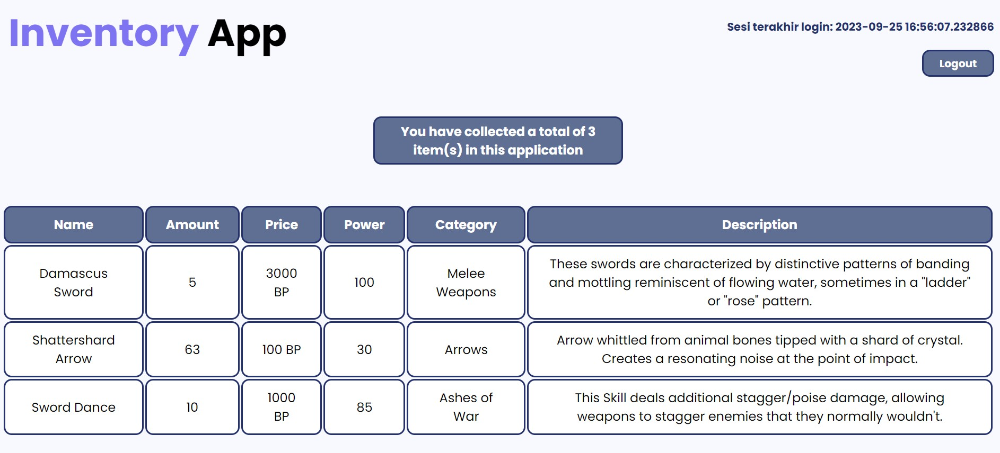

# **Inventory App**

**Muhammad Hilal Darul Fauzan**<br/>
**2206830542**<br/>
**PBP C**<br/>

Link deployment untuk menuju aplikasi Inventory App dapat diakses melalui [Inventory App](https://inventory-app.adaptable.app/main/).

# **Tugas 2: Implementasi Model-View-Template (MVT) pada Django**
Mengimplementasikan Model-View-Template (MVT) Django dan menerapkan beberapa konsep yang telah dipelajari di kelas serta menjawab beberapa pertanyaan.

## **Membuat proyek Django baru**
1. Buat direktori baru dengan nama yang ingin dipilih, contohnya `project_django` kemudian buka *command prompt* (Windows) atau *terminal shell* (Linux/Mac) di dalam direktori tersebut.
2. Buat *virtual environment* Python untuk mengisolasi proyek Python kita dengan menggunakan perintah `python -m venv env`.
3. Mengaktifkan *virtual environment* dengan perintah `env\Scripts\activate.bat` (Windows) atau `source env/bin/activate` (Linux/Mac). *Virtual environment* akan aktif dan ditandai dengan `(env)` di baris input terminal.
4. Buat file `requirements.txt` di dalam direktori proyek dan isi dengan daftar *dependencies* yang dibutuhkan untuk proyek. Contoh beberapa *dependencies* yang akan digunakan sebagai berikut.
    ```txt
    django
    gunicorn
    whitenoise
    psycopg2-binary
    requests
    urllib3
    ```
5. Install semua *dependencies* pada `requirements.txt` dengan perintah `python -m pip install -r requirements.txt`.
6. Buat proyek Django dengan nama `inventory_app` menggunakan perintah `django-admin startproject inventory_app .`.
7. Menambahkan `*` pada `ALLOWED_HOSTS` di dalam `settings.py` yang berada di dalam direktori `inventory_app` untuk mengizinkan akses dari semua host.
    ```python
    ...
    ALLOWED_HOSTS = ["*"]
    ...
    ```
8. Kembali ke *command prompt* atau *terminal shell* dan jalankan server dengan perintah `python manage.py runserver` di dalam direktori proyek (pastikan ada file `manage.py` di sana). Lalu akses http://localhost:8000 di peramban web untuk melihat animasi roket yang menandakan bahwa aplikasi Django telah berhasil dibuat.
9. Untuk menghentikan server, cukup dengan menekan tombol `Ctrl+C` di *command prompt* atau *terminal shell*. Pastikan juga untuk menonaktifkan *virtual environment* dengan menggunakan perintah `deactivate`.
10. Buat file `.gitignore` untuk menentukan berkas-berkas dan direktori-direktori yang harus diabaikan oleh Git. Isilah file tersebut dengan teks berikut.
    ```.gitignore
    # Django
    *.log
    *.pot
    *.pyc
    __pycache__
    db.sqlite3
    media

    # Backup files
    *.bak 

    # If you are using PyCharm
    # User-specific stuff
    .idea/**/workspace.xml
    .idea/**/tasks.xml
    .idea/**/usage.statistics.xml
    .idea/**/dictionaries
    .idea/**/shelf

    # AWS User-specific
    .idea/**/aws.xml

    # Generated files
    .idea/**/contentModel.xml

    # Sensitive or high-churn files
    .idea/**/dataSources/
    .idea/**/dataSources.ids
    .idea/**/dataSources.local.xml
    .idea/**/sqlDataSources.xml
    .idea/**/dynamic.xml
    .idea/**/uiDesigner.xml
    .idea/**/dbnavigator.xml

    # Gradle
    .idea/**/gradle.xml
    .idea/**/libraries

    # File-based project format
    *.iws

    # IntelliJ
    out/

    # JIRA plugin
    atlassian-ide-plugin.xml

    # Python
    *.py[cod] 
    *$py.class 

    # Distribution / packaging 
    .Python build/ 
    develop-eggs/ 
    dist/ 
    downloads/ 
    eggs/ 
    .eggs/ 
    lib/ 
    lib64/ 
    parts/ 
    sdist/ 
    var/ 
    wheels/ 
    *.egg-info/ 
    .installed.cfg 
    *.egg 
    *.manifest 
    *.spec 

    # Installer logs 
    pip-log.txt 
    pip-delete-this-directory.txt 

    # Unit test / coverage reports 
    htmlcov/ 
    .tox/ 
    .coverage 
    .coverage.* 
    .cache 
    .pytest_cache/ 
    nosetests.xml 
    coverage.xml 
    *.cover 
    .hypothesis/ 

    # Jupyter Notebook 
    .ipynb_checkpoints 

    # pyenv 
    .python-version 

    # celery 
    celerybeat-schedule.* 

    # SageMath parsed files 
    *.sage.py 

    # Environments 
    .env 
    .venv 
    env/ 
    venv/ 
    ENV/ 
    env.bak/ 
    venv.bak/ 

    # mkdocs documentation 
    /site 

    # mypy 
    .mypy_cache/ 

    # Sublime Text
    *.tmlanguage.cache 
    *.tmPreferences.cache 
    *.stTheme.cache 
    *.sublime-workspace 
    *.sublime-project 

    # sftp configuration file 
    sftp-config.json 

    # Package control specific files Package 
    Control.last-run 
    Control.ca-list 
    Control.ca-bundle 
    Control.system-ca-bundle 
    GitHub.sublime-settings 

    # Visual Studio Code
    .vscode/* 
    !.vscode/settings.json 
    !.vscode/tasks.json 
    !.vscode/launch.json 
    !.vscode/extensions.json
    .history
    ```

## **Membuat aplikasi dengan nama `main` pada proyek**
1. Buka *command prompt* pada direktori utama dan aktifkan *virtual environment* dengan perintah `env\Scripts\activate.bat`.
2. Buat aplikasi `main` dengan perintah `python manage.py startapp main`
3. Mendaftarkan aplikasi `main` ke proyek dengan menambahkan `'main'` pada `INSTALLED_APPS` di dalam file `settings.py`.
    ```python
    INSTALLED_APPS = [
        ...,
        'main',
        ...
    ]
    ```
 
## **Membuat model pada aplikasi `main`**
1. Pada langkah ini, ubah file `models.py` yang terdapat di dalam direktori aplikasi `main` untuk mendefinisikan model baru dengan nama `InventoryItem` dan memiliki atribut wajib sebagai berikut.
    * `name` sebagai nama item dengan tipe `CharField`.
    * `amount` sebagai jumlah item dengan tipe `IntegerField`.
    * `description` sebagai deskripsi item dengan tipe `TextField`.<br/>
Dipersilakan untuk menambahkan atribut lainnya jika diinginkan, seperti `price`, `power`, `category`. Namun, model aplikasi wajib memiliki ketiga atribut wajib di atas (`name`, `amount`, `description`).
2. Isi file `models.py` dengan kode berikut.
    ```python
    from django.db import models

    class InventoryItem(models.Model):
        name = models.CharField(max_length=255)
        amount = models.IntegerField()
        description = models.TextField()
        price = models.BigIntegerField()
        power = models.IntegerField()
        category = models.CharField(max_length=255)
    ```
3. Jalankan perintah `python manage.py makemigrations` untuk membuat migrasi model lalu jalankan perintah `python manage.py migrate` untuk menerapkan migrasi ke dalam basis data lokal.

> [!IMPORTANT]
> Setiap kali melakukan perubahan pada model, seperti menambahkan atau mengubah atribut, perlu melakukan migrasi untuk merefleksikan perubahan tersebut.

## **Membuat sebuah fungsi pada `views.py` untuk dikembalikan ke dalam sebuah template HTML**
1. Buat direktori baru bernama `templates` di dalam direktori aplikasi `main` buat file `main.html` di dalamnya.
2. Buka file `views.py` pada direktori `main` dan tambahkan baris kode di paling atas `from django.shortcuts import render`. Ini akan mengimpor fungsi render dari modul django.shortcuts, yang akan digunakan untuk melakukan proses rendering tampilan HTML dengan menggunakan data yang diberikan.
3. Buat fungsi `show_inventory` dengan parameter `request`. Di dalam fungsi ini, buatlah sebuah dictionary `context` yang berisi data yang akan dikirimkan ke tampilan. Setelah itu, gunakan fungsi `render` dengan tiga argumen, yaitu `request` (objek permintaan HTTP yang dikirim oleh pengguna), nama file HTML yang akan digunakan untuk me-render tampilan, dan `context` (dictionary yang berisi data untuk digunakan dalam tampilan yang dinamis). Setelah itu, kembalikan hasil rendering tersebut.
    ```python
    from django.shortcuts import render

    def show_inventory(request):
        context = {
            'creator' : 'Muhammad Hilal Darul Fauzan',
            'id' : 2206830542,
            'class' : 'PBP C',
            'list_items': [
                {
                    'name': 'Katana',
                    'amount': 20,
                    'description': 'Katana is a sword with a curved blade longer than 60 cm fitted with an uchigatana-style mounting and worn in a waist sash with the cutting edge facing up.',
                    'price': 500,
                    'power': 83,
                    'category':'Melee Weapons'
                },
                ...
            ]   
        }

        return render(request, 'main.html', context)
    ```
4. Buka file `main.html` yang telah dibuat sebelumnya dan lakukan perubahan pada kode yang tadinya statis menjadi kode Django yang sesuai untuk menampilkan data. Gunakan sintaks Django `{{ }}` untuk memasukkan data dari `context` yang telah dikirimkan oleh fungsi `show_inventory`.

## **Membuat sebuah routing pada `urls.py` aplikasi main untuk memetakan fungsi yang telah dibuat pada `views.py`**
Jika belum ada, buat file `urls.py` di dalam direktori main. Konfigurasi routing URL aplikasi `main` dengan melakukan perubahan pada file `urls.py` yang berada dalam direktori `main`.
```python
from django.urls import path
from main.views import show_inventory

app_name = 'main'

urlpatterns = [
    path('', show_inventory, name='show_inventory'),
]
```

## **Melakukan routing pada proyek agar dapat menjalankan aplikasi `main`**
Untuk menjalankan aplikasi yang dibuat perlu dilakukan konfigurasi routing proyek. Tambahkan path yang mengarah ke aplikasi tersebut di dalam file `urls.py` yang berada di dalam direktori proyek.
```python
"""
URL configuration for inventory_app project.

The `urlpatterns` list routes URLs to views. For more information please see:
    https://docs.djangoproject.com/en/4.2/topics/http/urls/
Examples:
Function views
    1. Add an import:  from my_app import views
    2. Add a URL to urlpatterns:  path('', views.home, name='home')
Class-based views
    1. Add an import:  from other_app.views import Home
    2. Add a URL to urlpatterns:  path('', Home.as_view(), name='home')
Including another URLconf
    1. Import the include() function: from django.urls import include, path
    2. Add a URL to urlpatterns:  path('blog/', include('blog.urls'))
"""
from django.contrib import admin
from django.urls import path, include

urlpatterns = [
    path('admin/', admin.site.urls),
    path('main/', include('main.urls')),
]
```

## **Melakukan deployment ke Adaptable**
1. Login [Adaptable.io](https://adaptable.io/) dengan menggunakan akun GitHub yang digunakan untuk membuat proyek.
2. Jika sudah login, silakan tekan tombol `New App`. Pilih `Connect an Existing Repository`.
3. Hubungkan [Adaptable.io](https://adaptable.io/) dengan GitHub dan pilih `All Repositories` pada proses instalasi.
4. Pilihlah repositori proyek aplikasi yang telah diunggah ke GitHub serta branch untuk deployment.
5. Pilihlah `Python App Template` sebagai template deployment.
6. Pilih `PostgreSQL` sebagai tipe basis data yang akan digunakan.
7. Sesuaikan versi Python dengan spesifikasi aplikasimu. Untuk mengeceknya, nyalakan virtual environment dan jalankan perintah `python --version`.
8. Pada bagian `Start Command` masukkan perintah `python manage.py migrate && gunicorn (main directory).wsgi`.
9. Masukkan nama aplikasi yang juga akan menjadi nama domain situs web aplikasimu.
10. Centang bagian `HTTP Listener on PORT` dan klik `Deploy App` untuk memulai proses deployment aplikasi.

## **Bonus: Membuat Unit Test**
Pada file `tests.py`, saya membuat beberapa testing tambahan selain yang diajarkan di tutorial.
```python
from django.test import TestCase, Client
from main.models import InventoryItem

class mainTest(TestCase):
    def test_main_url_is_exist(self):
        response = Client().get('/main/')
        self.assertEqual(response.status_code, 200)

    def test_main_using_main_template(self):
        response = Client().get('/main/')
        self.assertTemplateUsed(response, 'main.html')

    def test_response_has_utf8_charset(self):
        response = Client().get('/main/')
        content_type = response.get('Content-Type', '')
        self.assertIn('utf-8', content_type.lower())
    
    def test_inventory_items_displayed(self):
        response = self.client.get('/main/')
        for item in InventoryItem.objects.all():
            self.assertContains(response, item.name)
            self.assertContains(response, f'{item.price} BP')
            self.assertContains(response, item.category)

    def test_inventory_items_not_displayed(self):
        InventoryItem.objects.all().delete()
        response = self.client.get('/main/')
        for item in InventoryItem.objects.all():
            self.assertNotContains(response, item.name)
    
    def test_inventory_items_creation(self):
        item = InventoryItem.objects.create(
            name='War Cry',
            amount=3,
            description='The new charging heavy attack is different between swords and polearms. The charge before the weapon attack will also stagger enemies, but does not deal any damage.',
            price=7500,
            power=100,
            category='Ashes of War',
        )

        self.assertEqual(item.name, 'War Cry')
        self.assertEqual(item.amount, 3)
        self.assertEqual(item.description, 'The new charging heavy attack is different between swords and polearms. The charge before the weapon attack will also stagger enemies, but does not deal any damage.')
        self.assertEqual(item.price, 7500)
        self.assertEqual(item.power, 100)
        self.assertEqual(item.category, 'Ashes of War')
```
Jalankan tes dengan menggunakan perintah berikut.
```
python manage.py test
```
Berikut ini adalah hasil test yang telah dilakukan.
```
Found 6 test(s).
Creating test database for alias 'default'...
System check identified no issues (0 silenced).
......
----------------------------------------------------------------------
Ran 6 tests in 0.023s

OK
Destroying test database for alias 'default'...
```

## **Bagan Client Request and Response - Django**

Proses dimulai ketika seorang client membuka browser dan mengakses situs web yang diinginkannya. Pada tahap ini, web server siap melayani request dari client. Di dalam lingkungan server berbasis Python, Web Server Gateway Interface (WSGI) berperan penting dalam memproses HTTP request dari client. Selanjutnya, ada middleware yang berfungsi sebagai perantara integrasi teknologi yang digunakan dalam proyek web. Middleware ini bertugas memproses request dari client sebelum mengarahkannya ke URL Router. URL Router, yang biasanya diatur dalam file `urls.py`, mengatur routing alamat proyek yang sesuai dengan request client ke fungsi-fungsi yang terletak di `views.py`. Di dalam `views.py`, logika bisnis dan tampilan dari proyek website disusun. Data yang diperlukan untuk tampilan ini diambil dari database yang telah terstruktur menggunakan Object-Relational Mapping (ORM) dalam `models.py`. Selanjutnya, Context Processor berperan dalam mengirimkan data dari `views.py` ke template HTML. Template ini akan memanfaatkan data tersebut untuk menampilkan tampilan depan dari proyek sesuai dengan alur logika dari template tags. Setelah semua komponen tampilan disusun, middleware kembali berperan dalam memproses response sebelum dikirimkan kembali ke client. WSGI kembali berperan dalam memproses HTTP response dari server berbasis Python. Akhirnya, web server bertugas melayani response dari server dan mengirimkannya kepada client, sehingga client dapat melihat hasil dari website yang diaksesnya.

## **Mengapa kita perlu menggunakan *virtual environment*?**
*Virtual environment* diperlukan agar sistem dapat berjalan di lingkungan terisolasi. Di mana setiap proyek memiliki kebutuhan/dependensi yang berbeda-beda antara proyek satu dengan proyek yang lainnya. Dengan menggunakan *virtual environment*, maka proyek dapat berjalan sesuai dependensinya tanpa melakukan konfigurasi pada sistem operasi yang digunakan. File `requirements.txt` digunakan sebagai pencatatan daftar dependensi dari suatu proyek yang dijalankan dalam *virtual environment* tertentu. Hanya dengan mengetahui daftar dependensi yang ada melalui `requirements.txt` sebuah mesin host contohnya `Adaptable`, dapat mengetahui apa saja dependensi yang harus digunakan untuk menjalankan server. Hal ini juga memudahkan dalam proses penyimpanan di mana user tidak perlu melakukan push pada *virtual environment* karena sudah dicatat dengan baik di `requirements.txt` (*virtual environment* adalah direktori yang cukup memakan penyimpanan repository/host sehingga menghilangkannya dengan `.gitignore`).

## **Apakah kita tetap dapat membuat aplikasi web berbasis Django tanpa menggunakan *virtual environment*?**
Meskipun memungkinkan, namun tidak dianjurkan untuk membuat aplikasi web berbasis Django tanpa *virtual environment*, terutama jika berencana untuk meng-hostnya secara online. Jika hanya menjalankan proyek secara lokal di komputer kita sendiri, mungkin bisa menggunakan environment Python bawaan (root) dan menginstal semua dependensi proyek di sana. Tetapi ketika kita ingin meng-host aplikasi tersebut di layanan hosting online, seperti Adaptable, akan menjadi masalah. Server hosting akan mencari `requirements.txt` untuk mengetahui dependensi yang diperlukan. Jika tidak menggunakan *virtual environment* untuk mencatat dependensi ini, maka proyek kita mungkin tidak akan berjalan dengan baik atau tidak berjalan sama sekali di lingkungan hosting tersebut. Oleh karena itu, sangat disarankan untuk menggunakan *virtual environment* dalam pengembangan aplikasi Django untuk memastikan kelancaran di berbagai lingkungan hosting.

## **Apa itu MVC, MVT, MVVM? Apa saja perbedaan dari ketiganya?**
MVC (Model-View-Controller), MVT (Model-View-Template), dan MVVM (Model-View-ViewModel) adalah kerangka kerja arsitektur perangkat lunak yang digunakan dalam pengembangan aplikasi untuk memisahkan berbagai komponen aplikasi dan membuatnya lebih terstruktur serta mudah dikelola. Meskipun mereka memiliki konsep dasar yang serupa dalam pembagian tugas, mereka digunakan dalam konteks yang berbeda dan memiliki perbedaan dalam pengorganisasian komponen-komponen tersebut.

### **MVC (Model-View-Controller)**
| **Model** | **View** | **Controller** |
| --- | --- | --- |
| Mengurus representasi data serta aturan bisnis dalam sebuah aplikasi. Bagian ini bertanggung jawab untuk mengakses dan mengelola data, baik yang berasal dari basis data atau sumber lainnya. Model juga merancang logika bisnis seperti validasi data dan perhitungan. Sebagai contoh, dalam pengembangan aplikasi e-commerce, model akan mengatur cara penyimpanan dan akses data terkait produk, pelanggan, dan pesanan. | Komponen yang mengurus tampilan yang diperlihatkan kepada pengguna. Ini adalah aspek yang terlihat oleh pengguna ketika mereka berinteraksi dengan aplikasi yang sedang kita kembangkan. Tugas utama dari View adalah untuk menampilkan data yang berasal dari Model ke layar. Misalnya, dalam konteks aplikasi e-commerce, View akan bertanggung jawab dalam menampilkan daftar produk dan rincian pesanan kepada pengguna. | Bagian yang berfungsi sebagai perantara antara Model dan View. Komponen ini mengontrol alur informasi dalam aplikasi. Controller bertanggung jawab untuk menangani permintaan yang diajukan oleh pengguna, mengolahnya, dan mengirimkannya ke Model untuk memperbarui data atau mengambil data yang diperlukan. Sebagai contoh dalam aplikasi e-commerce, jika pengguna menambahkan produk ke dalam keranjang belanja, Controller akan mengelola proses agar Model dapat menyimpan data tersebut dan selanjutnya memberi tahu View untuk memperbarui tampilannya. |
  
### **MVT (Model-View-Template)**
| **Model** | **View** | **Template** |
| --- | --- | --- |
| Mirip dengan MVC, dalam konsep MVT, Model adalah elemen yang bertugas mengorganisir dan mengelola data aplikasi. Model menggambarkan struktur data dan logika yang berada di latar belakang tampilan. Fungsinya mencakup penghubungan aplikasi dengan basis data dan mengatur cara interaksi dengan data tersebut. | Komponen yang mengelola logika tampilan dalam kerangka kerja MVT. View ini mengendalikan cara data yang dikelola oleh Model dipresentasikan kepada pengguna. Dalam konteks MVT, View berperan sebagai pengendali yang menampilkan data dan mengambilnya dari Model untuk kemudian disajikan kepada pengguna. | Komponen yang mengurusi tampilan pengguna, seperti halaman web. Dalam kerangka kerja seperti Django, Template digunakan untuk merancang antarmuka halaman web yang dinamis dan mengintegrasikan data dari Model sehingga pengguna dapat melihat informasi yang dipresentasikan melalui View. |

### **MVVM (Model-View-ViewModel)**
| **Model** | **View** | **ViewModel** |
| --- | --- | --- |
| Elemen yang mengatur data dan logika aplikasi, mirip dengan peran Model dalam kerangka kerja MVC dan MVT. Model dan ViewModel dalam MVVM akan bekerja bersama-sama untuk mengambil dan menyimpan data. | Komponen yang memperlihatkan antarmuka pengguna dan berfungsi untuk memberitahu ViewModel tentang tindakan yang dilakukan pengguna. Tetapi, dalam MVVM, View berperan sebagai penampil yang hanya menampilkan data dan tidak mengandung logika aplikasi apa pun. | Sebagai salah satu komponen kunci dalam MVVM, ViewModel berperan sebagai penghubung antara Model dan View. Tugasnya adalah mengubah data dari Model ke dalam format yang dapat disajikan oleh View dan mengelola logika tampilan. |


### **Perbedaan MVC, MVT, dan MVVM**
* #### **MVC**
    MVC adalah pola desain yang luasnya diterapkan dalam berbagai jenis aplikasi, termasuk desktop, web, dan mobile. Dalam MVC, Controller memainkan peran penting dalam mengatur aliran informasi antara Model dan View, meskipun ada situasi di mana Model dan View dapat berinteraksi langsung. Ini mengedepankan pemisahan tugas, dengan Model mengelola data dan logika bisnis, View menampilkan data, dan Controller mengelola aliran informasi. Namun, dalam MVC, pengembang sering harus secara manual mengurus pembaruan tampilan ketika data berubah, yang dapat memerlukan kode tambahan.

* #### **MVT**
    MVT adalah konsep yang khususnya digunakan dalam pengembangan web dengan kerangka kerja Django berbasis Python. Salah satu komponennya, yaitu Template (dalam MVT Django), mengkhususkan diri dalam mengatur tampilan halaman web, sementara Model dan View berperan serupa dengan MVC. Template adalah komponen tambahan yang tidak ada dalam MVC tradisional, dan Django memiliki alat bawaan untuk mengelola pembaruan tampilan secara otomatis saat data berubah.

* #### **MVVM**
    MVVM sering digunakan dalam pengembangan aplikasi berbasis antarmuka pengguna (UI), seperti aplikasi mobile atau desktop. Ini fokus pada pemisahan tugas tampilan dan logika dalam UI, dengan ViewModel bertindak sebagai penghubung antara Model dan View, mengurangi ketergantungan antara keduanya. MVVM menggunakan sistem pengikatan data (data binding) untuk otomatis memperbarui tampilan ketika data berubah di ViewModel. Meskipun ini mengurangi kode boilerplate untuk pembaruan tampilan, penggunaan data binding yang kompleks dapat membuat debugging aplikasi menjadi sedikit lebih rumit.
<br/>

# **Tugas 3: Implementasi Form dan Data Delivery pada Django**
Mengimplementasikan Form dan Data Delivery dan menerapkan beberapa konsep yang telah dipelajari di kelas serta menjawab beberapa pertanyaan.

## **Membuat input `form` untuk menambahkan objek model pada app sebelumnya**
1. Mengatur routing dari `main/` ke `/` agar dapat langsung mengakses halaman utama tanpa menerima pesan `404 error` jika tidak menambahkan `/main/` secara manual pada URL.
    * Buka `urls.py` yang ada pada folder `inventory_app` dan modifikasi *path* `main/` menjadi `''` pada `urlpatterns` seperti berikut.
        ```python
        urlpatterns = [
            path('', include('main.urls')),
            path('admin/', admin.site.urls),
        ]
        ```

2. Membuat kerangka `views` dengan mengimplementasikan `skeleton`. Langkah ini berguna untuk menjaga konsistensi dalam desain situs web dan memperkecil kemungkinan terjadinya redudansi kode.
    * Buat folder `templates` pada *root folder* dan buat sebuah file HTML baru dengan nama `base.html`. File HTML ini berperan sebagai *template dasar* yang dapat digunakan secara umum untuk halaman web lain yang ada dalam proyek. Isi file `base.html` dengan kode di bawah ini:
        ```html
        
        <!DOCTYPE html>
        <html lang="en">
            <head>
                <meta charset="UTF-8" />
                <meta
                    name="viewport"
                    content="width=device-width, initial-scale=1.0"
                />
                
                
            </head>

            <body>
                
                
            </body>
        </html>
        ```
    * Buka file `settings.py` yang ada di subdirektori `inventory_app` dan modifikasi dengan menambahkan kode di bagian dictionary dengan key `DIRS` pada variabel list `TEMPLATES` seperti berikut:
        ```python
        ...
        TEMPLATES = [
            {
                'BACKEND': 'django.template.backends.django.DjangoTemplates',
                'DIRS': [BASE_DIR / 'templates'],
                'APP_DIRS': True,
                'OPTIONS': {
                    'context_processors': [
                        'django.template.context_processors.debug',
                        'django.template.context_processors.request',
                        'django.contrib.auth.context_processors.auth',
                        'django.contrib.messages.context_processors.messages',
                    ],
                },
            },
        ]
        ...
        ```
    * Pada `main/templates/main.html`, tambahkan kode berikut untuk meng-extend dari `base.html` yang baru saja dibuat.
        ```html
        
        
            ...
            <!-- kode html yang telah dibuat sebelumnya -->
            ...
        
        ```

3. Membuat form input data dan menampilkan data item pada HTML
    * Buat file baru bernama `forms.py` pada direktori `main` agar dapat menerima data item baru. Isilah `forms.py` dengan kode berikut:
        ```python
        from django.forms import ModelForm
        from main.models import InventoryItem

        class ProductForm(ModelForm):
            class Meta:
                model = InventoryItem
                fields = ["name", "amount", "price", "power", "category", "description"]
        ```
    * Modifikasi file `views.py` pada direktori `main` dengan menambahkan beberapa import dan fungsi baru `create_product` dengan parameter `request` untuk menghasilkan formulir yang dapat menambahkan data produk secara otomatis ketika data disubmit dari form. Berikut adalah potongan kode dari file `views.py`:
        ```python
        ...
        from django.http import HttpResponseRedirect
        from main.forms import ProductForm
        from main.models import InventoryItem
        from django.urls import reverse
        ...

        def create_product(request):
            form = ProductForm(request.POST or None)

            if form.is_valid() and request.method == "POST":
                form.save()
                return HttpResponseRedirect(reverse('main:show_inventory'))

            context = {'form': form}
            return render(request, "create_product.html", context)
        ```
    * Ubahlah isi dari fungsi `show_inventory` pada file `views.py` seperti berikut:
        ```python
        def show_inventory(request):
            items = InventoryItem.objects.all()
            
            context = {
                'creator' : 'Muhammad Hilal Darul Fauzan',
                'id' : '2206830542',
                'class' : 'PBP C',
                'list_items' : items,
            }

            return render(request, 'main.html', context)
        ```
    * Buka `urls.py` pada direktori `main` dengan menambahkan import fungsi `create_product`.
        ```python
        from main.views import show_inventory, create_product
        ```
    * Tambahkan path URL data form ke dalam `urlpatterns` pada `urls.py` di direktori `main`.
        ```python
        path('create-product', create_product, name='create_product'),
        ```
    * Buat file HTML dengan nama `create_product.html` pada `main/templates`. Isi file tersebut dengan kode berikut:
        ```html
         

        
        <h1>Add New Product</h1>

        <form method="POST">
            
            <table>
                {{ form.as_table }}
                <tr>
                    <td></td>
                    <td>
                        <input type="submit" value="Add Product"/>
                    </td>
                </tr>
            </table>
        </form>

        
        ```
    * Modifikasi `main.html` pada direktori `main/templates` dengan menambahkan kode berikut di dalam `` untuk menampilkan data item yang sudah diinput dan sebuah tombol untuk *redirect* ke halaman *form*.
        ```html
        ...
        <div class="container-tabel">
            <table>
            <tr class="judul-tabel">
                <th>Name</th>
                <th>Amount</th>
                <th>Price</th>
                <th>Power</th>
                <th>Category</th>
                <th>Description</th>
            </tr>
             Berikut cara memperlihatkan data produk di bawah baris ini 

            
                <tr>
                    <th>{{ item.name }}</th>
                    <th>{{ item.amount }}</th>
                    <th>{{ item.price }} BP</th>
                    <th>{{ item.power }}</th>
                    <th>{{ item.category }}</th>
                    <th>{{ item.description }}</th>
            
            </table>
        </div>

        <br />

        <a href="">
            <button class="add-to-cart">
                Add New Product
            </button>
        </a>
        ...
        
        ``` 

## **Tambahkan 5 fungsi `views` untuk melihat objek yang sudah ditambahkan dalam format HTML, XML, JSON, XML by ID, dan JSON by ID**
1. Ubah fungsi `show_inventory` dalam file `views.py` pada direktori `main` untuk dapat menghasilkan *render* HTML yang mencakup informasi tentang pembuat web dan data item yang telah dimasukkan.
    ```python
    def show_inventory(request):
        items = InventoryItem.objects.all()

        context = {
            'creator' : 'Muhammad Hilal Darul Fauzan',
            'id' : '2206830542',
            'class' : 'PBP C',
            'list_items' : items,
        }

        return render(request, 'main.html', context)
    ```

2. Buka `views.py` pada direktori `main` dan tambahkan *import* `HttpResponse` dan `serializers` di bagian paling atas.
    ```python
    from django.http import HttpResponse
    from django.core import serializers
    ```

3. Buat fungsi dengan parameter `request` untuk mengembalikan data-data dalam bentuk XML dengan menambahkan kode berikut pada `views.py`:
    ```python
    def show_xml(request):
        data = InventoryItem.objects.all()
        return HttpResponse(serializers.serialize("xml", data), content_type="application/xml")
    ```

4. Buat fungsi dengan parameter `request` untuk mengembalikan data-data dalam bentuk JSON dengan menambahkan kode berikut pada `views.py`:
    ```python
    def show_json(request):
        data = InventoryItem.objects.all()
        return HttpResponse(serializers.serialize("json", data), content_type="application/json")
    ```

5. Buat fungsi dengan parameter `request` dan `id` untuk mengembalikan data dari suatu ID tertentu dalam bentuk XML dengan menambahkan kode berikut pada `views.py`:
    ```python
    def show_xml_by_id(request, id):
        data = InventoryItem.objects.filter(pk=id)
        return HttpResponse(serializers.serialize("xml", data), content_type="application/xml")
    ```

6. Buat fungsi dengan parameter `request` dan `id` untuk mengembalikan data dari suatu ID tertentu dalam bentuk JSON dengan menambahkan kode berikut pada `views.py`:
    ```python
    def show_json_by_id(request, id):
        data = InventoryItem.objects.filter(pk=id)
        return HttpResponse(serializers.serialize("json", data), content_type="application/json")
    ```

## **Membuat routing URL untuk masing-masing `views` yang telah ditambahkan pada poin 2**
Buka file `urls.py` pada direktori `main` dan *import* fungsi yang sudah dibuat pada poin 2, yaitu `show_xml`, `show_json`, `show_xml_by_id`, dan `show_json_by_id`. Kemudian perbarui *path url* yang di dalam `urlpatterns` untuk mengakses semua fungsi tersebut.
```python
from django.urls import path
from main.views import show_inventory, create_product, show_xml, show_json, show_xml_by_id, show_json_by_id

app_name = 'main'

urlpatterns = [
    path('', show_inventory, name='show_inventory'),
    path('create-product', create_product, name='create_product'),
    path('xml/', show_xml, name='show_xml'),
    path('json/', show_json, name='show_json'),
    path('xml/<int:id>/', show_xml_by_id, name='show_xml_by_id'),
    path('json/<int:id>/', show_json_by_id, name='show_json_by_id'),
]
```
## **Bonus: Menambahkan pesan "Kamu menyimpan X item pada aplikasi ini" (dengan X adalah jumlah data item yang tersimpan pada aplikasi) dan menampilkannya di atas tabel data**
```html
...
    <div class="item-count">
      <p>You have collected a total of {{ list_items|length }} item(s) in this application</p>
    </div>
  
    <div class="container-tabel">
      <table>
        <tr class="judul-tabel">
          <th>Name</th>
          <th>Amount</th>
          <th>Price</th>
          <th>Power</th>
          <th>Category</th>
          <th>Description</th>
        </tr>
         Berikut cara memperlihatkan data produk di bawah baris ini 

        
          <tr>
              <th>{{ item.name }}</th>
              <th>{{ item.amount }}</th>
              <th>{{ item.price }} BP</th>
              <th>{{ item.power }}</th>
              <th>{{ item.category }}</th>
              <th>{{ item.description }}</th>
        
      </table>
    </div>
...
```
Berikut ini adalah tampilan yang dihasilkan setelah menambahkan fitur di atas:


## **Apa perbedaan antara form `POST` dan form `GET` dalam Django?**
Dalam Django, metode `POST` dan `GET` adalah dua pendekatan berbeda untuk mengirim data antara browser dan web server saat mengirim informasi dari form HTML. Metode `POST` digunakan untuk mengirim data dari browser ke web server dengan cara yang lebih aman dan tersembunyi, karena data dikirimkan dalam badan permintaan HTTP sehingga data tidak terlihat oleh pengguna selama proses pengiriman. Contohnya, ketika mengirim kata sandi atau informasi pribadi. Di sisi lain, metode `GET` mengirim data sebagai bagian dari *URL*, sehingga data dapat terlihat oleh siapa pun yang melihat *URL*. Ini cocok untuk operasi baca saja, seperti pencarian atau pengiriman parameter melalui *URL*. Pengaksesan data yang dikirim melalui metode `GET` di Django dapat menggunakan objek `request.GET`.

Selain itu, ada perbedaan dalam hal bookmarking dan keamanan. Data yang dikirim dengan metode `POST` tidak cocok untuk di-bookmark karena data tersebut tidak terlihat pada *URL*, sehingga lebih aman untuk data yang sensitif. Sementara metode `GET` cocok untuk di-bookmark karena data terlihat pada *URL*, tetapi tetap harus berhati-hati karena hal ini mungkin tidak cocok untuk data yang bersifat sensitif dan lebih rentan terhadap potensi serangan. Penting juga untuk diingat bahwa permintaan dengan metode `POST` biasanya tidak di-cache oleh browser, sehingga pengguna selalu mendapatkan *fresh response* dari server. Di sisi lain, metode `GET` di-cache oleh browser, di mana dapat meningkatkan kinerja dan tetap harus diawasi karena pengguna mungkin melihat data yang sudah kadaluwarsa.

Penting juga untuk mempertimbangkan peran pemrosesan server saat memilih metode. Secara umum, metode `POST` digunakan ketika perlu melakukan tindakan yang berdampak pada server, seperti mengubah atau menyimpan data contohnya mengirim email, menambahkan catatan ke database, atau melakukan operasi lain yang memengaruhi status server. Sebaliknya, metode `GET` lebih cocok untuk tindakan yang hanya melibatkan pembacaan data dari server tanpa melakukan perubahan, seperti pencarian, penyaringan, atau pengambilan data yang sudah ada.

## **Apa perbedaan utama antara XML, JSON, dan HTML dalam konteks pengiriman data?**
Singkatnya, XML digunakan untuk data yang sangat terstruktur, JSON untuk data yang lebih sederhana dan efisien di aplikasi web, sementara HTML untuk membuat tampilan halaman web yang bisa dilihat oleh manusia.

* XML adalah *markup language* yang digunakan untuk menyimpan dan mengirim data dengan struktur yang ketat. XML menyediakan aturan untuk menentukan jenis data menggunakan tag dan atribut untuk mendefinisikan elemen data. Cocok digunakan untuk pertukaran data yang kompleks dengan validasi ketat, tetapi ukuran file XML cenderung besar dan parsingnya memakan banyak sumber daya.

* JSON adalah format penukaran data secara terbuka yang dapat dibaca dengan mudah oleh manusia maupun mesin atau komputer. Mesin dapat dengan mudah mengurai dan menghasilkan JSON dalam berbagai bahasa pemrograman. JSON memiliki sifat yang independen dari setiap bahasa pemrograman serta merupakan output API yang umum dalam berbagai aplikasi. Namun, JSON tidak memiliki dukungan bawaan untuk definisi skema data yang kuat.

* HTML adalah *markup language* yang digunakan untuk membuat tampilan halaman web yang bisa diakses oleh manusia melalui web browser. Biasanya, HTML tidak digunakan untuk pertukaran data struktural antara aplikasi, tetapi dapat menyematkan data untuk digunakan dalam *client-side interactions* dengan JavaScript. HTML berperan sebagai struktur dasar dari semua halaman web modern.

## **Mengapa JSON sering digunakan dalam pertukaran data antara aplikasi web modern?**
Karena JSON merupakan format teks yang ringan dan fleksibilitas struktur data, ini sangat membantu pengembang dalam mengelola dan menggambarkan data yang kompleks. Ketersediaan dukungan lintas bahasa pemrograman dan platform membuatnya sangat serbaguna. Itulah sebabnya JSON banyak digunakan secara luas dalam aplikasi web modern, terutama saat berinteraksi dengan layanan web dan API eksternal. Dukungan yang luas dari berbagai *framework* dan *library* web menjadikan JSON sangat penting dalam pengembangan aplikasi web. Kelebihan lainnya adalah JSON memiliki fitur keamanan yang dapat mengurangi risiko serangan injeksi kode. Pada konteks aplikasi real-time, JSON memungkinkan pembaruan data yang efisien antara klien dan server yang meningkatan pengalaman pengguna.

## **Mengakses kelima URL di poin 2 menggunakan Postman, membuat screenshot dari hasil akses URL pada Postman**
1. Pastikan server sudah berjalan dengan perintah `python manage.py runserver`.

2. Buka Postman dan buat sebuah *request* baru dengan *method* `GET` dan  isi dengan beberapa *url* sebagai berikut untuk mengetes apakah data terkirimkan dengan baik.
    * HTML (http://localhost:8000)
    
    * XML (http://localhost:8000/xml)
    
    * JSON (http://localhost:8000/json)
    
    * XML by ID (http://localhost:8000/xml/[id])
    
    * JSON by ID (http://localhost:8000/json/[id])
    
<br/>

# **Tugas 4: Implementasi Autentikasi, Session, dan Cookies pada Django**
Mengimplementasikan konsep authentication, session, cookies dan menerapkan beberapa konsep yang telah dipelajari di kelas serta menjawab beberapa pertanyaan.

## **Mengimplementasikan fungsi registrasi, login, dan logout untuk memungkinkan pengguna untuk mengakses aplikasi sebelumnya dengan lancar**
1. Mengaktifkan Python *virtual environment*.
2. Buka `views.py` yang ada pada subdirektori `main` dan tambahkan beberapa import seperti di bawah ini.
    ```python
    import datetime
    from django.contrib.auth.decorators import login_required
    from django.contrib.auth.forms import UserCreationForm
    from django.contrib.auth import authenticate, login, logout
    from django.contrib import messages
    from django.shortcuts import render, redirect
    from django.core import serializers
    from django.http import HttpResponse
    from django.http import HttpResponseRedirect
    from django.urls import reverse
    from main.forms import ProductForm
    from main.models import InventoryItem
    ```
3. Tambahkan beberapa fungsi untuk `register`, `login`, dan `logout` dengan parameter `request`.
    ```python
    def register(request):
        form = UserCreationForm()

        if request.method == "POST":
            form = UserCreationForm(request.POST)
            if form.is_valid():
                form.save()
                messages.success(request, 'Your account has been successfully created!')
                return redirect('main:login')
            
        context = {'form':form}
        return render(request, 'register.html', context)

    def login_user(request):
        if request.method == 'POST':
            username = request.POST.get('username')
            password = request.POST.get('password')
            user = authenticate(request, username=username, password=password)

            if user is not None:
                login(request, user)
                response = HttpResponseRedirect(reverse("main:show_inventory")) 
                response.set_cookie('last_login', str(datetime.datetime.now()))
                return response
            else:
                messages.info(request, 'Sorry, incorrect username or password. Please try again.')

        context = {}
        return render(request, 'login.html', context)

    def logout_user(request):
        logout(request)
        response = HttpResponseRedirect(reverse('main:login'))
        response.delete_cookie('last_login')
        return response
    ```
4. Buat file HTML baru dengan nama `login.html` pada direktori `main/templates`. Isilah `login.html` dengan kode di bawah ini.
    ```html
    

    
        <title>Login</title>
    

    

    <div class = "login">
        <div class="login-container">
            <div class="login-forms">
                <form method="POST" action="" class="login-field">
                    
                    <h1 class="login-title">Login</h1>
        
                    <div class="login-box">
                        <i class='bx bx-user login__icon'></i>
                        <input type="text" name="username" placeholder="Username" class="form-control">
                    </div>
        
                    <div class="login-box">
                        <i class='bx bx-lock-alt login__icon'></i>
                        <input type="password" name="password" placeholder="Password" class="form-control">
                    </div>
        
                    <input class="login_btn" type="submit" value="Login">
        
                    <div>
                        <span class="login-account">Don't have an account yet?</span>
                        <span class="register-button"><a href="">Register Now</a></span>
                    </div>
                </form>
            </div>
                    
            
                
                    <p>{{ message }}</p>
                
            
        </div>
    </div>

    
    ```

5. Buat file HTML baru dengan nama `register.html` pada direktori `main/templates`. Isilah `register.html` dengan kode di bawah ini.
    ```html
    

    
        <title>Register</title>
    

    

    <div class="register">
        <div class="register-container">
            <div class="register-forms">
                <form method="POST" action="" class="register-field">
                    
                    <h1 class="register-title">Register</h1>

                    <div class="register-box">
                        <i class='bx bx-user register__icon'></i>
                        <input type="text" name="username" placeholder="Username" class="form-control">
                    </div>
                        
                    <div class="register-box">
                        <i class='bx bx-lock-alt register__icon'></i>
                        <input type="password" name="password" placeholder="Password" class="form-control">
                    </div>

                    <div class="register-box">
                        <i class='bx bxs-key register__icon'></i>
                        <input type="password" name="password" placeholder="Password Verification" class="form-control">
                    </div>
        
                    <input class="register_btn" type="submit" value="Register">
        
                    <div>
                        <span class="register-account">Already have an account?</span>
                        <span class="login-button"><a href="">Login Here</a></span>
                    </div>
                </form>
            </div>

            
                
                    <p>{{ message }}</p>
                
            
        </div>
    </div>

    
    ```
6. Tambahkan potongan kode ini di dalam *tag div* dengan nama class `header-controls` pada berkas `main.html`.
    ```html
    ...
    <div class="header-controls">
        ...
        <a href="">
            <button>
                Logout
            </button>
        </a>
    </div>
    ...
    ```
7. Buka `urls.py` yang berada di dalam direktori `main`. Tambahkan import untuk fungsi `register`, `login_user`, dan `logout_user`. Lalu tambahkan path untuk ketiga fungsi tersebut di list `urlpatterns`.
    ```python
    from django.urls import path
    from main.views import show_inventory, create_product, show_xml, show_json, show_xml_by_id, show_json_by_id, register, login_user, logout_user

    app_name = 'main'

    urlpatterns = [
        ...
        path('register/', register, name='register'),
        path('login/', login_user, name='login'),
        path('logout/', logout_user, name='logout'),
    ]
    ```
8. Jika belum, buka `views.py` dan tambahkan import `login_required` pada bagian paling atas.
    ```python
    from django.contrib.auth.decorators import login_required
    ```
9. Tambahkan potongan kode `@login_required(login_url='/login')` di atas fungsi `show_inventory` agar halaman `main` hanya dapat diakses oleh pengguna yang sudah login (terautentikasi).
    ```python
    @login_required(login_url='/login')
    ```

## **Membuat dua akun pengguna dengan masing-masing tiga dummy data menggunakan model yang telah dibuat pada aplikasi sebelumnya untuk setiap akun di lokal**
Username: hilalfzn


Username: hilaljuga


## **Menghubungkan model `InventoryItem` dengan `User`**
1. Buka `models.py` dan tambahkan import seperti potongan kode di bawah ini.
    ```python
    from django.contrib.auth.models import User
    ```
2. Pada model `InventoryItem`, tambahkan potongan kode seperti berikut.
    ```python
    class InventoryItem(models.Model):
        ...
        user = models.ForeignKey(User, on_delete=models.CASCADE)
    ```
3. Buka `views.py` dan modifikasi fungsi `create_product` seperti di bawah ini.
    ```python
    def create_product(request):
        form = ProductForm(request.POST or None)

        if form.is_valid() and request.method == "POST":
            product = form.save(commit=False)
            product.user = request.user
            product.save()
            return HttpResponseRedirect(reverse('main:show_inventory'))

        context = {'form': form}
        return render(request, "create_product.html", context)
    ```
4. Modifikasi fungsi `show_inventory` menjadi seperti potongan kode di bawah ini.
    ```python
    def show_inventory(request):
        items = InventoryItem.objects.filter(user=request.user)

        context = {
            'name': request.user.username,
            ...
        }
    ```
5. Menyimpan perubahan dan melakukan migrasi dengan `python manage.py makemigrations`.
6. Jika terjadi error saat melakukan migrasi model, maka pilih `1` untuk menetapkan *default value* untuk *field user* pada semua *row* yang telah dibuat pada basis data.
7. Ketik angka `1` lagi untuk menetapkan *user* dengan ID 1 (yang sudah dibuat sebelumnya) pada model yang sudah ada.
8. Jalankan perintah `python manage.py migrate` untuk menerapkan perubahan migrasi yang telah dibuat pada langkah sebelumnya.

## **Menampilkan detail informasi pengguna yang sedang logged in seperti username dan menerapkan cookies seperti last login pada halaman utama aplikasi**
1. Buka `views.py` dan tambahkan beberapa import berikut (jika belum ada).
    ```python
    import datetime
    from django.http import HttpResponseRedirect
    from django.urls import reverse
    ```
2. Pada fungsi `login_user` tepatnya di blok `if user is not None` tambahkan potongan kode di bawah ini.
    ```python
    ...
    if user is not None:
        login(request, user)
        response = HttpResponseRedirect(reverse("main:show_inventory")) 
        response.set_cookie('last_login', str(datetime.datetime.now()))
        return response
    ...
    ```
3. Tambahkan potongan kode `'last_login': request.COOKIES['last_login']` ke dalam variabel `context` di fungsi `show_inventory`.
    ```python
    context = {
        'name': request.user.username,
        'creator': 'Muhammad Hilal Darul Fauzan',
        'id' : '2206830542',
        'class' : 'PBP C',
        'list_items' : items,
        'last_login': request.COOKIES['last_login'],
    }
    ```
4. Modifikasi file `main.html` pada `main/templates` dengan potongan kode berikut.
    ```html
    ...
    <div class="header-controls">
        <div class="last-login">
            <h4>Sesi terakhir login: {{ last_login }}</h4>
        </div>
        ...
    </div>
    ...
    ```
5. Jalankan perintah `python manage.py runserver` dan cobalah untuk login. Data *last login* akan muncul di halaman *main*.
6. Untuk memeriksa data cookie `last_login`, gunakan fitur *inspect element* dan buka tab *Application* atau *Storage*. Setelah itu, klik opsi *Cookies* untuk melihat semua data cookies yang tersedia. Selain `last_login`, kita juga dapat melihat data lain seperti `sessionid` dan `csrftoken`. Berikut ini adalah contoh tampilannya.
    

## **Bonus**
1. Tambahkan tombol dan fungsi untuk menambahkan amount suatu objek sebanyak satu dan tombol untuk mengurangi jumlah stok suatu objek sebanyak satu.
    * Tambahkan fungsi `add_items` dan `dec_items` pada `views.py` di direktori `main`.
        ```python
        def add_items(request, item_id):
            if request.method == 'POST' and 'Increment' in request.POST:
                item = InventoryItem.objects.get(id=item_id)

                if item.amount > 0:
                    item.amount += 1
                    item.save()
            return HttpResponseRedirect(reverse('main:show_inventory'))

        def dec_items(request, item_id):
            if request.method == 'POST' and 'Decrement' in request.POST:
                item = InventoryItem.objects.get(id=item_id)
                
                if item.amount > 1:
                    item.amount -= 1
                    item.save()
                else:
                    item.delete()
            return HttpResponseRedirect(reverse('main:show_inventory'))
        ```
    * Buka `urls.py` pada direktori `main` dan tambahkan import untuk kedua fungsi di atas. Lalu, tambahkan juga *path url* di dalam `urlpatterns` untuk mengakses kedua fungsi tersebut.
        ```python
        from django.urls import path
        from main.views import show_inventory, create_product, show_xml, show_json, show_xml_by_id, show_json_by_id, register, login_user, logout_user, add_items, dec_items

        app_name = 'main'

        urlpatterns = [
            ...
            path('add_items/<int:item_id>/', add_items, name='add_items'),
            path('dec_items/<int:item_id>/', dec_items, name='dec_items'),
        ]
        ```
    * Buka file `main.html` dan tambahkan potongan kode berikut ini.
        ```html
        ...
            <td>
                <form action="" method="post">
                    
                    <button type="submit" name="Increment">Add</button>
                </form>
            </td>
            <td>
                <form action="" method="post">
                    
                    <button type="submit" name="Decrement">Decrease</button>
                </form>
            </td>
        ...
        ```
        Note: Tambahkan juga table header untuk menyesuaikan isi table data

2. Tambahkan tombol dan fungsi untuk menghapus suatu objek dari inventori.
    * Tambahkan fungsi `remove_items` pada `views.py` di direktori `main`.
        ```python
        def remove_items(request, item_id):
            if request.method == 'POST' and 'Remove' in request.POST:
                item = InventoryItem.objects.get(id=item_id)
                item.delete()
            return HttpResponseRedirect(reverse('main:show_inventory'))
        ```
    * Buka `urls.py` pada direktori `main` dan tambahkan import untuk fungsi di atas. Lalu, tambahkan juga *path url* yang di dalam `urlpatterns` untuk mengakses fungsi tersebut.
        ```python
        from django.urls import path
        from main.views import show_inventory, create_product, show_xml, show_json, show_xml_by_id, show_json_by_id, register, login_user, logout_user, add_items, dec_items, remove_items

        app_name = 'main'

        urlpatterns = [
            ...
            path('remove_items/<int:item_id>/', remove_items, name='remove_items'),
        ]
        ```
    * Buka file `main.html` dan tambahkan potongan kode berikut ini.
        ```html
        ...
            <td>
                <form action="" method="post">
                    
                    <button type="submit" name="Remove">Remove</button>
                </form>
            </td>
        ...
        ```
        Note: Tambahkan juga table header untuk menyesuaikan isi table data

Berikut ini adalah tampilan *main* setelah mengimplementasikan bonus.


## **Apa itu Django `UserCreationForm`, dan jelaskan apa kelebihan dan kekurangannya?**
`UserCreationForm` adalah formulir bawaan Django yang digunakan untuk membuat pengguna baru. Formulir ini merupakan turunan dari `ModelForm` dan dirancang khusus untuk model *User* bawaan Django. Formulir ini biasanya digunakan pada halaman registrasi untuk mempermudah proses pembuatan akun pengguna baru.

### Kelebihan
* Mudah Digunakan: Formulir ini sangat mudah digunakan dan mengintegrasikannya ke dalam aplikasi Django. Kita hanya perlu menambahkan beberapa baris kode untuk mendapatkannya bekerja.

* Keamanan: `UserCreationForm` dirancang dengan keamanan dalam pikiran. Misalnya, ia akan memvalidasi bahwa kata sandi memenuhi kebijakan keamanan Django.

* Menghemat Waktu: Karena formulir ini sudah ada di library standar Django, kita tidak perlu menulis kode untuk validasi dan penanganan formulir dari awal.

* Cocok dengan Model User Django: Formulir ini dibangun khusus untuk bekerja dengan model User bawaan Django, menjadikannya solusi yang sangat cocok jika kita menggunakan sistem autentikasi Django bawaan.

### Kekurangan
* Keterbatasan Fitur: `UserCreationForm` dirancang untuk menjadi sederhana dan karenanya hanya menyediakan fitur-fitur dasar untuk membuat pengguna. Jika memerlukan fitur yang lebih canggih (seperti konfirmasi email, CAPTCHA, dll.), kita harus mengextend atau menulis formulir sendiri.

* Ketergantungan pada Model User Bawaan: Jika menggunakan model User kustom atau sistem autentikasi yang berbeda, kita mungkin akan menemukan beberapa masalah kompatibilitas.

* Tampilan Default: Meskipun ini bisa dengan mudah diubah, tampilan bawaan mungkin tidak cocok dengan estetika situs web, membutuhkan tambahan pekerjaan styling.

* Tidak Fleksibel: Jika perlu memodifikasi perilaku standar `UserCreationForm`(misalnya, menyimpan beberapa data tambahan saat registrasi), kita harus membuat subclass dan mungkin menulis beberapa metode tambahan yang bisa memakan waktu.

## **Apa perbedaan antara autentikasi dan otorisasi dalam konteks Django, dan mengapa keduanya penting?**
### Autentikasi
Autentikasi adalah proses verifikasi identitas pengguna yang berusaha mengakses sebuah aplikasi. Dalam konteks Django, ini biasanya melibatkan memeriksa apakah kombinasi username dan password yang diberikan oleh pengguna valid atau tidak. Django menyediakan mekanisme autentikasi bawaan yang cukup kuat, termasuk dukungan untuk berbagai back-end autentikasi dan fungsionalitas seperti `reset password` dan `remember me`.

Contoh penggunaan autentikasi dalam Django adalah sebagai berikut:
* Menggunakan `@login_required` dekorator untuk memastikan bahwa hanya pengguna yang telah terautentikasi yang dapat mengakses suatu view.
* Menggunakan `authenticate()` dan `login()` dari `django.contrib.auth` untuk melakukan proses autentikasi.

### Otorisasi
Otorisasi merupakan proses penentuan apa yang diizinkan dilakukan oleh pengguna tersebut. Otorisasi tidak memeriksa siapa pengguna, tetapi apa yang mereka boleh atau tidak boleh lakukan. Django menyediakan sistem izin yang dapat digunakan untuk mendefinisikan otorisasi pada tingkat model atau objek. Kita juga bisa menggunakan sistem groups dan permissions untuk mengatur izin yang lebih kompleks.

Contoh penggunaan otorisasi dalam Django:
* Menggunakan `@permission_required` atau `@user_passes_test` dekorator untuk membatasi akses berdasarkan izin atau kondisi lain.
* Mengecek `user.is_staff` atau `user.is_superuser` sebagai bagian dari logika otorisasi.

### Mengapa Keduanya Penting?
Berikut ini alasan mengapa autentikasi dan otorisasi penting:
* Keamanan: Salah satu aspek keamanan aplikasi web paling mendasar adalah memastikan bahwa hanya pengguna yang berwenang yang bisa mengakses sumber daya. Autentikasi dan otorisasi membantu kita mencapai ini.

* Pengalaman Pengguna yang Lebih Baik: Dengan mengetahui identitas pengguna (melalui autentikasi) dan apa yang mereka boleh atau tidak boleh lakukan (melalui otorisasi), kita bisa menawarkan pengalaman yang lebih kustom dan relevan.

* Pemisahan Tanggung Jawab: Otorisasi memungkinkan kita untuk memisahkan apa yang bisa dilakukan oleh pengguna biasa, staf, dan admin, membuat sistem yang lebih mudah dikelola.

* Auditing dan Accountability: Dengan sistem autentikasi dan otorisasi yang kuat, kita juga bisa lebih mudah dalam melacak aktivitas pengguna, yang bisa sangat berguna untuk tujuan audit atau untuk menyelidiki insiden keamanan.

* Kepatuhan terhadap Standar dan Regulasi: Banyak standar keamanan dan regulasi sektor industri mengharuskan kontrol autentikasi dan otorisasi yang kuat.

Keduanya adalah pilar keamanan yang saling melengkapi. Tanpa autentikasi, sistem tidak bisa membuat keputusan otorisasi yang tepat, dan tanpa otorisasi, autentikasi saja tidak cukup untuk memastikan keamanan aplikasi.

## **Apa itu *cookies* dalam konteks aplikasi web, dan bagaimana Django menggunakan *cookies* untuk mengelola data sesi pengguna?**
Cookies adalah potongan kecil data yang disimpan oleh web browser di sisi klien. Cookies sering digunakan untuk mengingat informasi tentang pengguna antar sesi. Misalnya, mereka bisa digunakan untuk menyimpan preferensi pengguna, untuk melacak keberadaan pengguna di situs web atau paling umum  untuk menyimpan token autentikasi.

Django, sebagai framework web yang berbasis Python, memiliki fitur bawaan untuk mengelola cookies dan data sesi pengguna. Berikut ini adalah cara kerja Django dalam menggunakan cookies untuk mengelola data sesi pengguna:

* Inisiasi Session Cookies: Ketika pengguna mengunjungi situs Django untuk pertama kalinya, server akan membuat sebuah cookie sesi dan mengirimnya ke peramban web pengguna. Cookie ini memuat sebuah ID sesi yang unik, yang akan digunakan untuk mengidentifikasi sesi pengguna.

* Penyimpanan Data Berdasarkan ID Sesi: Informasi sesi dari pengguna disimpan di server, bukan dalam cookie itu sendiri. Informasi ini bisa mencakup data seperti status login, preferensi user, isi keranjang belanja, dan lain-lain.

* Pengelolaan Data Berdasarkan ID Sesi: Saat pengguna mengirimkan sebuah permintaan ke situs yang menggunakan mekanisme sesi, Django akan menggunakan ID sesi dari cookie untuk mengakses data sesi yang tersimpan di server. Dengan ini, server dapat menyediakan data yang sesuai dengan kebutuhan aplikasi dan pengguna.

* Memperbarui Data Sesuai dengan Permintaan: Sejalan dengan interaksi pengguna di situs, data sesi dapat diperbarui atau ditambah sesuai kebutuhan. Django menawarkan sebuah API yang memudahkan proses penyimpanan dan pengambilan data sesi ini.

* Penutupan Sesi Berdasarkan Permintaan: Apabila sesi pengguna berakhir, misalnya karena pengguna telah melakukan logout atau sesi telah melewati waktu kadaluwarsainformasi sesi akan dihapus dari penyimpanan di server dan cookie sesi di browser pengguna juga bisa dihapus.

## **Apakah penggunaan *cookies* aman secara *default* dalam pengembangan web, atau apakah ada risiko potensial yang harus diwaspadai?**
Penggunaan cookies dalam pengembangan web pada umumnya dianggap aman asalkan dilakukan dengan benar, namun ada beberapa risiko potensial yang perlu diperhatikan seperti di bawah ini.

* Cross-Site Scripting (XSS): Jika situs kita rentan terhadap XSS, penyerang dapat mencuri cookies dan menggunakannya untuk mengakses akun pengguna.

* Cross-Site Request Forgery (CSRF): Penyerang bisa mencoba melakukan aksi tertentu dalam aplikasi web kita dengan menggunakan identitas pengguna yang telah terautentikasi.

* Cookie Hijacking atau Man-in-the-Middle Attack: Jika situs kita tidak dienkripsi dengan benar menggunakan HTTPS, ada risiko cookies bisa dicuri saat data dikirim antara klien dan server.

* Third-Party Cookies: Cookie dari pihak ketiga bisa digunakan untuk melacak perilaku pengguna tanpa sepengetahuan mereka, yang merupakan masalah privasi.
<br/>

# **Tugas 5: Desain Web menggunakan HTML, CSS dan Framework CSS**
Mengimplementasikan desain web berdasarkan beberapa hal yang telah dipelajari di kelas selama di kelas dan tutorial (CSS, Framework, dsb) serta menjawab beberapa pertanyaan.

## **Kustomisasi desain pada template HTML yang telah dibuat pada Tugas 4 dengan menggunakan CSS atau CSS framework (seperti Bootstrap, Tailwind, Bulma)**
Pada proyek Inventory App ini, saya menggunakan eksternal CSS serta Bootstrap untuk membuat styling di beberapa fitur. Singkatnya, langkah yang saya lakukan adalah membuat selector untuk mengelompokkan mana saja yang akan di styling dengan model yang sama, apakah ingin keseluruhan diubah atau hanya beberapa bagian saja. Jika sudah, mulai styling untuk selectornya.

### **Kustomisasi halaman login, register, dan tambah inventori**
* Login Page


* Register Page


* Add Item Page


* Edit Item Page


* Main Page


## **Bonus**
Pada `static/main.css` tambahkan styling potongan kode di bawah untuk memberikan warna yang berbeda (background) pada baris terakhir dari item pada inventori.
```css
tr:last-child {
    background-color: rgba(95, 196, 95, 0.8);
}
```

## **Jelaskan manfaat dari setiap element selector dan kapan waktu yang tepat untuk menggunakannya**

Selector-element adalah salah satu bagian penting dari CSS (Cascading Style Sheets) yang digunakan untuk memilih elemen HTML yang akan diberi gaya atau tampilan. Setiap elemen selector memiliki manfaat dan waktu yang tepat untuk digunakan sesuai dengan kebutuhan desain dan struktur halaman web. 

Berikut adalah beberapa elemen selector yang umum digunakan beserta manfaat dan waktu yang tepat untuk menggunakannya:

1. Selector Universal (Universal Selector)
    Selector universal (*) memungkinkan untuk memilih semua elemen dalam dokumen HTML. Selector ini biasa digunakan untuk memberi gaya secara umum pada semua elemen. Selector universal perlu digunakan dengan hati-hati karena dapat memberikan dampak pada seluruh elemen di halaman web. Elemen ini sebaiknya digunakan hanya dalam kasus tertentu di mana Anda ingin memberikan gaya secara global.

2. Selector Elemen (Element Selector)
    Selector elemen memungkinkan untuk memilih semua elemen HTML dengan tipe tertentu. Elemen ini umumnya digunakan untuk mengganti gaya elemen-elemen dasar. Selector elemen tepat digunakan setiap kali ingin mengganti gaya atau menargetkan semua elemen dengan tipe tertentu.

3. Selector *class* (Class Selector):
    Selector *class*  memungkinkan untuk memilih elemen berdasarkan nilai atribut class. Hal ini sangat berguna ketika ingin mengganti gaya beberapa elemen yang memiliki *class* yang sama. Selector *class*  tepat digunakan ketika ingin mengganti gaya atau menargetkan elemen-elemen dengan *class*  tertentu.

4. Selector ID (ID Selector)
    Selector ID memungkinkan untuk memilih elemen berdasarkan nilai atribut id. Selector ID biasanya digunakan untuk menargetkan elemen tunggal yang unik dalam halaman web. Selector ini sebaiknya digunakan dengan bijak dan hanya untuk elemen yang benar-benar unik dalam halaman web. Terlalu banyak penggunaan ID dapat menyulitkan pemeliharaan kode CSS.

5. Selector Keturunan (Descendant Selector):
    Selector keturunan memungkinkan untuk memilih elemen yang menjadi anak dari elemen lain. Selector ini berguna untuk mengganti gaya elemen-elemen dalam konteks tertentu, misalnya, elemen dalam sebuah div. Selector keturunan tepat digunakan ketika ingin menargetkan elemen dalam konteks tertentu, seperti elemen yang berada dalam suatu div atau elemen yang ada dalam elemen lain.

6. Selector Pseudo-class (Pseudo-class Selector):
    Selector pseudo-class memungkinkan untuk memilih elemen berdasarkan keadaan atau interaksi pengguna. Misalnya, penggunaan :hover untuk mengganti gaya elemen saat mouse mengarah padanya. Selector pseudo-class tepat digunakan ketika ingin mengganti gaya elemen berdasarkan keadaan atau tindakan tertentu.

7. Selector Atribut (Attribute Selector):
    Selector atribut memungkinkan untuk memilih elemen berdasarkan atribut dan nilainya, seperti atribut src atau href. Selector ini berguna ketika ingin mengganti gaya atau menargetkan elemen berdasarkan atribut tertentu. Selector atribut tepat digunakan ketika perlu menargetkan elemen berdasarkan nilai atribut tertentu.

8. Selector Sibling (Sibling Selector):
    Selector sibling memungkinkan untuk memilih elemen yang merupakan saudara atau berdekatan dengan elemen lain. Misalnya, ketika memilih elemen yang sejajar dengan elemen yang memiliki kelas tertentu. Selector sibling tepat digunakan ketika ingin mengganti gaya elemen yang berdekatan atau sejajar dengan elemen lain.

9. Selector Anak (Child Selector):
    Selector anak langsung memungkinkan untuk memilih elemen yang merupakan anak langsung dari elemen lain. Selector ini berguna ketika ingin menargetkan elemen anak langsung dalam sebuah elemen, tanpa mempengaruhi elemen anak yang lebih dalam. Gunakan selector anak langsung ketika ingin menargetkan elemen anak langsung dari elemen lain.

10. Selector Grup (Grouping Selector):
    Selector grup memungkinkan untuk mengelompokkan beberapa selector dalam satu peraturan CSS. Selector ini digunakan untuk mengatur gaya yang sama untuk beberapa elemen sekaligus. Selector grup tepat digunakan ketika ingin memberikan gaya yang sama untuk beberapa elemen sekaligus.

## **Jelaskan HTML5 Tag yang kamu ketahui**

HTML5 adalah versi terbaru dari bahasa markup HTML yang digunakan untuk membangun struktur dan konten halaman web. HTML5 mengenalkan beberapa elemen dan atribut baru yang memungkinkan pengembang web untuk membuat konten web yang lebih kaya dan interaktif. Berikut adalah beberapa tag HTML5 yang saya ketahui:

1. **`<html>`** <br/>
Tag `<html>` adalah tag akar (root tag) dari setiap halaman HTML. Semua tag lain berada di dalam tag ini. Tag ini mendefinisikan awal dari halaman web dan akhir dari halaman web.

   Contoh:
   ```html
   <html>
   <!-- Konten halaman web di sini -->
   </html>
   ```

2. **`<head>`** <br/>
Tag `<head>` berisi informasi meta tentang halaman web. Tag ini adalah bagian yang tidak terlihat pada halaman web itu sendiri, tetapi berisi informasi penting seperti judul halaman, metadata, dan tautan ke stylesheet.

   Contoh:
   ```html
   <head>
       <title>Contoh Halaman Web</title>
       <meta charset="UTF-8">
       <link rel="stylesheet" href="style.css">
   </head>
   ```

3. **`<time>`** <br/>
Tag `<time>` digunakan untuk menandai konten yang berkaitan dengan waktu atau tanggal dalam dokumen HTML. Tag ini membantu mesin pencari dan peramban web memahami dan menginterpretasikan informasi waktu dengan lebih baik.

   Contoh:
   ```html
    <p>Acara: <time datetime="2023-10-15T15:30:00">15 Oktober 2023, 15:30</time></p>

   ```

4. **`<meta>`** <br/>
Tag `<meta>` digunakan untuk menyisipkan metadata ke dalam halaman web, seperti karakter encoding, deskripsi, kata kunci, dan informasi lainnya yang berguna untuk mesin pencari dan browser.

   Contoh:
   ```html
   <meta charset="UTF-8">
   <meta name="description" content="Ini adalah contoh halaman web">
   ```

5. **`<link>`** <br/>
Tag `<link>` digunakan untuk menghubungkan halaman HTML dengan berkas CSS eksternal, yang mengatur gaya dan tampilan halaman web.

   Contoh:
   ```html
   <link rel="stylesheet" href="style.css">
   ```

6. **`<body>`** <br/>
Tag `<body>` berisi semua konten yang akan ditampilkan di halaman web, seperti teks, gambar, video, dan tag lainnya. Tag ini adalah bagian yang terlihat oleh pengguna.

   Contoh:
   ```html
   <body>
       <h1>Selamat Datang di Contoh Halaman Web</h1>
       <p>Ini adalah halaman web sederhana.</p>
   </body>
   ```

7. **``** <br/>
Tag `` digunakan untuk menampilkan gambar di halaman web. Tag memerlukan atribut `src` yang berisi URL gambar dan atribut `alt` yang berisi teks alternatif untuk gambar.

   Contoh:
   ```html
   
   ```
   
8. **`<nav>`** <br/>
Tag `<nav>` digunakan untuk mendefinisikan bagian navigasi dalam halaman web. Tag ini biasanya berisi tautan menu.

   Contoh:
   ```html
   <nav>
       <ul>
           <li><a href="#">Beranda</a></li>
           <li><a href="#">Tentang Kami</a></li>
       </ul>
   </nav>
   ```

9. **`<section>`** <br/>
Tag `<section>` digunakan untuk mengelompokkan konten yang memiliki tema atau topik yang sama dalam halaman web.

   Contoh:
   ```html
   <section>
       <h2>Artikel Terbaru</h2>
       <p>Ini adalah artikel terbaru di halaman web kami.</p>
   </section>
   ```

10. **`<article>`** <br/>
Tag `<article>` digunakan untuk mengelompokkan konten yang merupakan sebuah artikel atau bagian utama dari halaman web.<br/>
    Contoh:
    ```html
    <article>
        <h2>Judul Artikel</h2>
        <p>Ini adalah konten artikel.</p>
    </article>
    ```

11. **`<footer>`** <br/>
Tag `<footer>` digunakan untuk mendefinisikan bagian bawah (footer) dari halaman web, yang sering berisi informasi seperti hak cipta, tautan penting, dan informasi kontak. <br/>
    Contoh:
    ```html
    <footer>
        <p>&copy; 2023 Contoh Perusahaan</p>
    </footer>
    ```

12. **`<header>`** <br/>
Tag `<header>` digunakan untuk mendefinisikan bagian atas (header) dari halaman web. Tag ini sering berisi judul, logo, dan tag lain yang ingin ditempatkan di bagian atas halaman. <br/>
    Contoh:
    ```html
    <header>
        <h1>Logo Perusahaan</h1>
        <nav>
            <ul>
                <li><a href="#">Beranda</a></li>
                <li><a href="#">Tentang Kami</a></li>
            </ul>
        </nav>
    </header>
    ```

13. **`<a>`** <br/>
Tag `<a>` digunakan untuk membuat tautan (link) ke halaman web lain atau sumber lainnya. Tag ini memerlukan atribut `href` yang berisi URL tujuan tautan.<br/>
    Contoh:
    ```html
    <a href="https://www.contoh.com">Kunjungi Contoh.com</a>
    ```

14. **`<video>` dan `<audio>`** <br/>
Tag `<video>` digunakan untuk menampilkan video, sementara tag `<audio>` digunakan untuk menampilkan audio atau suara. Tag ini memerlukan atribut `src` yang berisi URL media. <br/>
    Contoh:
    ```html
    <video src="video.mp4" controls></video>
    <audio src="audio.mp3" controls></audio>
    ```

15. **`<input>`** <br/>
Tag `<input>` digunakan untuk membuat kotak input, seperti kotak teks, kotak seleksi, atau tombol. Jenis input ditentukan oleh atribut `type`.<br/>
    Contoh:
    ```html
    <input type="text" name="nama" placeholder="Masukkan Nama Anda">
    <input type="checkbox" name="setuju" id="setuju">
    <label for="setuju">Saya setuju dengan syarat dan ketentuan.</label>
    ```

16. **`<canvas>`** <br/>
Tag `<canvas>` digunakan untuk menggambar grafik, animasi, dan grafis lainnya secara dinamis menggunakan JavaScript. <br/>
    Contoh:
    ```html
    <canvas id="myCanvas" width="300" height="150"></canvas>
    ```

17. **`<svg>`** <br/>
Tag `<svg>` digunakan untuk membuat grafik vektor dan grafis skalabel yang dapat diubah ukurannya tanpa kehilangan kualitas. Ini digunakan dengan elemen-elemen SVG seperti `<circle>`, `<rect>`, dan lainnya. <br/>
    Contoh:
    ```html
    <svg width="100" height="100">
        <circle cx="50" cy="50" r="40" stroke="black" stroke-width="2" fill="red" />
    </svg>
    ```

18. **`<ul>` dan `<li>`** <br/>
Tag `<ul>` digunakan untuk membuat daftar tak terurut (unordered list), sedangkan tag `<li>` digunakan untuk membuat item dalam daftar. <br/>
    Contoh:
    ```html
    <ul>
        <li>Item 1</li>
        <li>Item 2</li>
        <li>Item 3</li>
    </ul>
    ```

19. **`<ol>`** <br/>
Tag `<ol>` digunakan untuk membuat daftar terurut (ordered list) dengan nomor atau huruf. <br/>
    Contoh:
    ```html
    <ol>
        <li>Item A</li>
        <li>Item B</li>
        <li>Item C</li>
    </ol>
    ```

20. **`<dl>`, `<dt>`, dan `<dd>`** <br/>
 Tag `<dl>` digunakan untuk membuat daftar deskripsi (description list). Tag `<dt>` digunakan untuk mendefinisikan istilah dalam daftar, sementara tag `<dd>` digunakan untuk memberikan deskripsi terkait istilah tersebut. <br/>
    Contoh:
    ```html
    <dl>
        <dt>HTML</dt>
        <dd>HyperText Markup Language</dd>
        <dt>CSS</dt>
        <dd>Cascading Style Sheets</dd>
    </dl>
    ```

## **Jelaskan perbedaan antara margin dan padding**
Secara singkat, Margin adalah ruang di sekitar elemen HTML, yang berfungsi untuk mengatur jarak antara elemen tersebut dengan elemen-elemen lain di sekitarnya. Margin tidak memengaruhi ukuran elemen itu sendiri, tetapi hanya mengatur jaraknya dari elemen-elemen lain di sekitarnya. Sementara itu, Padding adalah ruang di dalam elemen HTML, yang berfungsi untuk mengatur jarak antara konten elemen dan batas (border) elemen tersebut. Padding memengaruhi ukuran elemen itu sendiri, karena ruang padding tersebut dihitung sebagai bagian dari elemen tersebut.

Perbedaan dari Margin dan Padding dapat dilihat secara lebih jelas dalam tabel berikut:
| Aspek           | Margin                                   | Padding                                |
|-----------------|------------------------------------------|----------------------------------------|
| Definisi        | Ruang di luar elemen konten              | Ruang di dalam elemen konten           |
| Fungsi Utama    | Mengatur jarak antara elemen dengan elemen lain di sekitarnya | Mengatur jarak antara konten elemen dengan batas elemen itu sendiri |
| Pengaruh Terhadap Ukuran Elemen | Tidak mempengaruhi ukuran elemen itu sendiri | Mempengaruhi ukuran elemen itu sendiri   |
| Pengaturan      | Margin dapat diatur menggunakan properti seperti `margin-top`, `margin-right`, `margin-bottom`, dan `margin-left` | Padding dapat diatur menggunakan properti seperti `padding-top`, `padding-right`, `padding-bottom`, dan `padding-left` |
| Penerapan Umum  | Digunakan untuk mengatur jarak antara elemen-elemen, misalnya mengatur jarak antara elemen-elemen dalam layout | Digunakan untuk mengatur ruang internal elemen, misalnya mengatur ruang dalam kotak teks atau elemen konten lainnya |
| Tumpang Tindih  | Margin elemen dapat tumpang tindih dengan margin elemen lainnya dan mempengaruhi elemen-elemen di sekitarnya | Padding elemen tidak tumpang tindih dengan padding elemen lainnya dan hanya mempengaruhi konten dalam elemen tersebut |
| Pengaruh Terhadap Tata Letak | Memengaruhi tata letak elemen secara eksternal (luar elemen) | Memengaruhi tata letak elemen secara internal (dalam elemen) |

## **Jelaskan perbedaan antara framework CSS Tailwind dan Bootstrap. Kapan sebaiknya kita menggunakan Bootstrap daripada Tailwind, dan sebaliknya?**

Perbedaan antara framework CSS Tailwind dan Bootstrap, serta kapan sebaiknya kita menggunakan framework tersebut dapat dilihat dalam tabel berikut ini.

| Aspek                         | Framework Tailwind CSS                            | Framework Bootstrap                               |
|-------------------------------|---------------------------------------------------|---------------------------------------------------|
| **Konsep**                  | Mendasarkan pada konsep "utility-first," di mana membangun tampilan dengan menggabungkan kelas-kelas utilitas yang sudah ada untuk mengatur tampilan elemen. | Mendasarkan pada konsep kerangka kerja yang lebih terstruktur dengan komponen yang telah dibuat sebelumnya untuk membangun tampilan. |
| **Ukuran**                      | Lebih kecil dalam ukuran file CSS karena hanya menghasilkan kode CSS yang dibutuhkan. | Lebih besar dalam ukuran file CSS karena menyertakan komponen yang sudah dibuat sebelumnya. |
| **Fleksibilitas**               | Memungkinkan tingkat fleksibilitas yang tinggi dalam desain dan tampilan karena dapat menggabungkan kelas-kelas utilitas sesuai kebutuhan. | Lebih terstruktur dan kurang fleksibel dalam hal desain karena komponen Bootstrap memiliki gaya yang sudah ditentukan. |
| **Kustomisasi**                | Memerlukan penulisan lebih banyak kode HTML untuk mengatur tampilan, tetapi memberikan kustomisasi yang lebih besar. | Memungkinkan kustomisasi dengan mengganti variabel Sass, tetapi tidak sefleksibel Tailwind. |
| **Penggunaan**                  | Cocok untuk proyek-proyek yang membutuhkan tampilan yang sangat kustomisasi atau memiliki desain yang unik. | Cocok untuk proyek-proyek yang ingin cepat membangun tampilan dengan komponen siap pakai dan tampilan yang konsisten. |
| **Pembelajaran**                | Memerlukan waktu belajar lebih lama karena perlu menguasai kelas-kelas utilitas dan memahami cara menggunakannya. | Lebih mudah dipelajari karena memiliki dokumentasi yang baik dan komponen yang sudah dibuat sebelumnya. |
| **Kelengkapan Komponen** | Memerlukan pembuatan komponen dari awal atau menggunakan ekstensi pihak ketiga. | Sudah menyediakan beragam komponen UI yang dapat digunakan dengan mudah. |
| **Performa**                    | Lebih efisien dalam hal ukuran file CSS dan memungkinkan mengurangi overhead yang tidak perlu. | Memiliki beberapa elemen yang mungkin tidak digunakan dalam proyek Anda, sehingga dapat meningkatkan ukuran file. |
| **Kapan Sebaiknya Menggunakan**  | - Ketika memiliki waktu untuk menguasai kelas-kelas utilitas dan ingin fleksibilitas dalam desain. - Ketika ingin tampilan dengan kustomisasi yang tinggi atau memiliki desain yang unik. - Ketika ingin mengurangi overhead CSS dengan hanya menggunakan kelas-kelas yang diperlukan. - Ketika ingin mengontrol ukuran file CSS secara ketat. | - Ketika ingin cepat membangun tampilan dengan komponen UI yang sudah ada. - Ketika ingin memastikan tampilan yang konsisten dan memiliki gaya yang sudah ditentukan. - Ketika tidak memiliki banyak waktu untuk kustomisas tampilan. - Ketika menginginkan dokumentasi yang kuat dan banyak dukungan komunitas.|